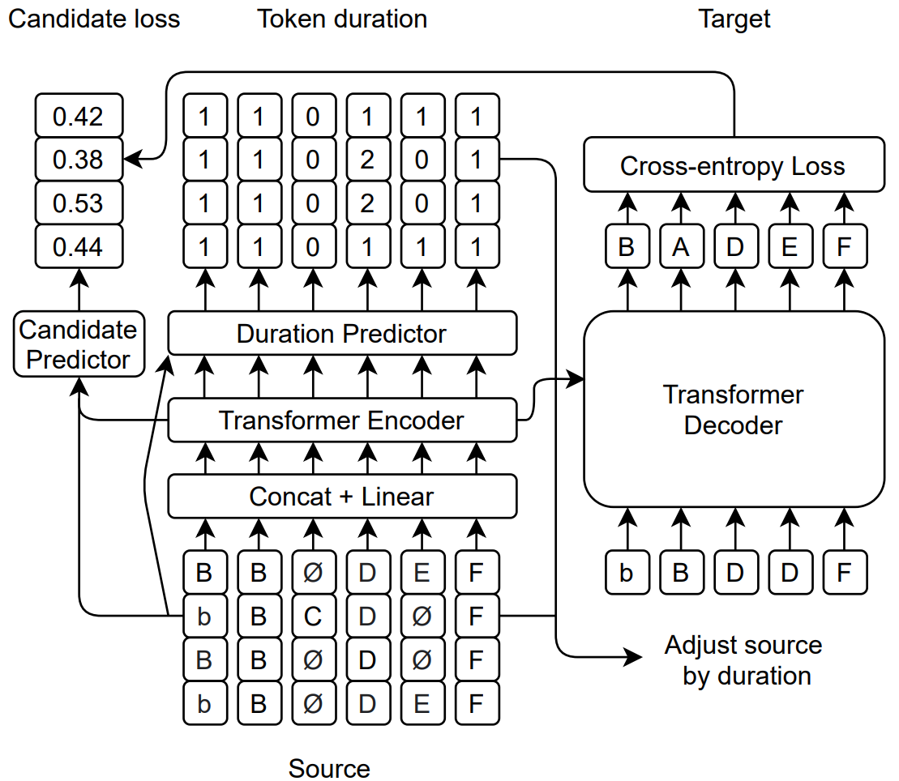

# FastCorrect 2

[FastCorrect 2: Fast Error Correction on Multiple Candidates for Automatic Speech Recognition](https://arxiv.org/abs/2109.14420), by Yichong Leng, Xu Tan, Rui Wang, Linchen Zhu, Jin Xu, Wenjie Liu, Linquan Liu, Tao Qin, Xiang-Yang Li, Edward Lin, Tie-Yan Liu in *Findings of EMNLP 2021*,
is a novel non-autoregressive error correction method for automatic speech recognition. It uses multiple candidates from ASR beam search results to correct errors.

<!--   -->

  Model structure of FastCorrect 2 

## Dependencies
Currently we implement FastCorrect on the [fairseq-0.10.1](https://github.com/pytorch/fairseq/tree/v0.10.1). You can refer to fairseq installation.
Some dependencies are as follows:
- Python 3
- NumPy
- PyTorch==1.6.0
- fairseq==0.10.1

## FastCorrect Pipeline
The whole pipeline of FastCorrect 2 consists of 4 steps, the first step is for pretraining only, which is necessary for small ASR dataset like AISHELL-1,
and auxiliary for large production ASR dataset.

### Step 1, Unpaired Text Data Preparation

We use wiki data as unpaired text data from [here](https://dumps.wikimedia.org/zhwiki/latest/zhwiki-latest-pages-articles.xml.bz2).

The wiki data can be extracted with [wikiextractor](https://github.com/attardi/wikiextractor). Also, we can perform some further pre-processing such as 1) removing non-Chinese letter, 2) splitting sentence, 3) changing number to its corresponding Chinese letter.

Finally, we can add noise to unpaired text data. The noised text and origin text are used as pseudo paired dataset for ASR correction training.
The script of adding noise can be found in `scripts/add_noise.py`.

Note: in our paper we use the internal 400M unpaired text data. If only wikidata is used (about 14M after splitting sentence), we recommend
to add noise several (e.g. 5) times with different random seeds, resulting larger pretraining data size.

### Step 2, Data generation

For all text data, we perform tokenization and bpe with SentencePiece package. Given (pseudo or real) paired data for ASR correction, we first align source sentence with target sentence, obtaining the number of target token corresponding with
each source token. The script of aligning sentences can be found in `scripts/align_cal_werdur_v2.py`. A faster version of alignment can be found in `scripts/align_cal_werdur_fast.py`. The performance drop of fast alignment is very slightly.

Then we binarize the alignment results with `runs/data-gen.sh`.

Note: For AISHELL-1 dataset, which is small and easy to fit, we decode training set with 3 early-epoch models (i.e., averaged model of epoch 5-9, averaged model of epoch 10-14, averaged model of epoch 15-19).

### Step 3, Pre-training and Fine-tuning:
We can pretrain the FastCorrect 2 model on pseudo paired data with `runs/train_pretrain.sh`.

Then we fine-tune the FastCorrect 2 model on real paired data with `runs/train_ft.sh`.

The fine-tuning data of FastCorrect 2 on AISHELL-1 can be found in [here](https://msramllasc.blob.core.windows.net/modelrelease/FastCorrect2_training_data_aishell.tar.gz).

We load the pretrained model with the help of `--restore-file` flag.

### Step 4, Inference

We test FastCorrect 2 model with `runs/test_ft.sh` (eval data are in `eval_data` folder).

After installing sctk (`./install_sctk.sh`), we can calculate WER with `cal_wer_aishell.sh`.

## Reference

If you FastCorrect 2 useful in your work, you can cite the paper as below:

    @inproceedings{leng-etal-2021-fastcorrect-2,
        title = "{F}ast{C}orrect 2: Fast Error Correction on Multiple Candidates for Automatic Speech Recognition",
        author = "Leng, Yichong  and Tan, Xu  and
        Wang, Rui  and Zhu, Linchen  and Xu, Jin  and Liu, Wenjie  and Liu, Linquan  and Li, Xiang-Yang  and Qin, Tao  and
        Lin, Edward  and Liu, Tie-Yan",
        booktitle = "Findings of the Association for Computational Linguistics: EMNLP 2021",
        month = nov,
        year = "2021",
    }

## Code of Conduct
This project has adopted the [Microsoft Open Source Code of Conduct](https://opensource.microsoft.com/codeofconduct),
[trademark notice](https://docs.opensource.microsoft.com/releasing/), and [security reporting instructions](https://docs.opensource.microsoft.com/releasing/maintain/security/).

