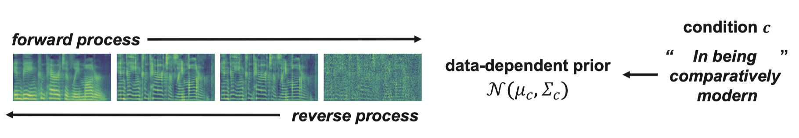

## PriorGrad-acoustic

This repository is an official PyTorch implementation of the paper:

> Sang-gil Lee, Heeseung Kim, Chaehun Shin, Xu Tan, Chang Liu, Qi Meng, Tao Qin, Wei Chen, Sungroh Yoon, Tie-Yan Liu. "PriorGrad: Improving Conditional Denoising Diffusion Models with Data-Dependent Adaptive Prior." _ICLR_ (2022).
>[[arxiv]](https://arxiv.org/abs/2106.06406)
>



This repository contains an acoustic model (text-conditional mel-spectrogram synthesis) presented in PriorGrad. PriorGrad acoustic model features the state-of-the-art audio naturalness for text-to-speech, with fast training and inference speed. 

## Abstract
Denoising diffusion probabilistic models have been recently proposed to generate high-quality samples by estimating the gradient of the data density. The framework assumes the prior noise as a standard Gaussian distribution, whereas the corresponding data distribution may be more complicated than the standard Gaussian distribution, which potentially introduces inefficiency in denoising the prior noise into the data sample because of the discrepancy between the data and the prior. In this paper, we propose PriorGrad to improve the efficiency of the conditional diffusion model (for example, a vocoder using a mel-spectrogram as the condition) by applying an adaptive prior derived from the data statistics based on the conditional information. We formulate the training and sampling procedures of PriorGrad and demonstrate the advantages of an adaptive prior through a theoretical analysis. Focusing on the audio domain, we consider the recently proposed diffusion-based audio generative models based on both the spectral and time domains and show that PriorGrad achieves faster convergence and superior performance, leading to an improved perceptual quality and tolerance to a smaller network capacity, and thereby demonstrating the efficiency of a data-dependent adaptive prior.

## Demo

Refer to the [demo page](https://speechresearch.github.io/priorgrad/) for the samples from the model.

## Quick Start and Examples

1. Navigate to PriorGrad-acoustic root, install dependencies, and initialize submodule ([HiFi-GAN](https://github.com/jik876/hifi-gan) vocoder)
   ```bash
   # the codebase has been tested on Python 3.8 with PyTorch 1.8.2 LTS and 1.10.2 conda binaries
   pip install -r requirements.txt
   git submodule init
   git submodule update
   ```

Note: We release the pre-built LJSpeech binary dataset that can skip the preprocessing (step 2, 3 and 4). Refer to the [Pretrained Weights](#pretrained-weights) section below.

2. Prepare the dataset (LJSpeech)
   ```bash
   mkdir -p data/raw/
   cd data/raw/
   wget https://data.keithito.com/data/speech/LJSpeech-1.1.tar.bz2
   tar -xvf LJSpeech-1.1.tar.bz2
   cd ../../
   python datasets/tts/lj/prepare.py
   ```
3. Forced alignment for duration predictor training
   ```bash
   # The following commands are tested on Ubuntu 18.04 LTS.
   sudo apt install libopenblas-dev libatlas3-base
   # Download MFA from https://montreal-forced-aligner.readthedocs.io/en/stable/aligning.html
   wget https://github.com/MontrealCorpusTools/Montreal-Forced-Aligner/releases/download/v1.0.1/montreal-forced-aligner_linux.tar.gz
   # Unzip to montreal-forced-aligner
   tar -zxvf montreal-forced-aligner_linux.tar.gz
   # See https://github.com/MontrealCorpusTools/Montreal-Forced-Aligner/issues/149 regarding this fix
   cd montreal-forced-aligner/lib/thirdparty/bin && rm libopenblas.so.0 && ln -s ../../libopenblasp-r0-8dca6697.3.0.dev.so libopenblas.so.0
   cd ../../../../
   # Run MFA
   ./montreal-forced-aligner/bin/mfa_train_and_align \
   data/raw/LJSpeech-1.1/mfa_input \
   data/raw/LJSpeech-1.1/dict_mfa.txt \
   data/raw/LJSpeech-1.1/mfa_outputs \
   -t ./montreal-forced-aligner/tmp \
   -j 24
   ```

4. Build binary data and extract mean & variance for PriorGrad-acoustic. The mel-spectrogram is compatible with open-source [HiFi-GAN](https://github.com/jik876/hifi-gan)

   ```bash
   PYTHONPATH=. python datasets/tts/lj/gen_fs2_p.py \
   --config configs/tts/lj/priorgrad.yaml \
   --exp_name priorgrad
   ```

5. Train PriorGrad-acoustic
   ```bash
   # the following command trains PriorGrad-acoustic with default parameters defined in configs/tts/lj/priorgrad.yaml
   CUDA_VISIBLE_DEVICES=0 PYTHONPATH=. python tasks/priorgrad.py \
   --config configs/tts/lj/priorgrad.yaml \
   --exp_name priorgrad \
   --reset
   ```
   
   ### Optional feature: Monotonic alignment search (MAS) support
   Instead of MFA, PriorGrad also supports Monotonic Alignment Search (MAS) used in [Glow-TTS](https://github.com/jaywalnut310/glow-tts/) for duration predictor training.
      ```bash
      # install monotonic_align for MAS training
      cd monotonic_align && python setup.py build_ext --inplace && cd ..
      # The following command trains a variant of PriorGrad which uses MAS for training the duration predictor.
      CUDA_VISIBLE_DEVICES=0 PYTHONPATH=. python tasks/priorgrad.py \
      --config configs/tts/lj/priorgrad.yaml \
      --hparams dur=mas \
      --exp_name priorgrad_mas \
      --reset
      ```

6. Download pre-trained HiFi-GAN vocoder
    ```
    mkdir hifigan_pretrained
    ```
    download `generator_v1`, `config.json` from [Google Drive](https://drive.google.com/drive/folders/1XtZ_AaYIsnx1zh_HxhrG5SZ6MUJV59gm) to `hifigan_pretrained/`

   
7. Inference (fast mode with T=12)
   ```bash
   # the following command performs test set inference along with a grid search of the reverse noise schedule. 
   CUDA_VISIBLE_DEVICES=0 PYTHONPATH=. python tasks/priorgrad.py \
   --config configs/tts/lj/priorgrad.yaml \
   --exp_name priorgrad \
   --reset \
   --infer \
   --fast --fast_iter 12
   ```
   
   When `--infer --fast`, the model applies grid search of beta schedules with the specified number of `--fast_iter` steps for the given model checkpoint.
   
   2, 6, and 12 `--fast_iter` are officially supported. If the value higher than 12 is provided, the model uses a linear beta schedule. Note that the linear schedule is expected to perform worse.
   
   `--infer` without `--fast` performs slow sampling with the same `T` as the forward diffusion used in training.

## Text-to-speech with User-given Text

`tasks/priorgrad_inference.py` provides the text-to-speech inference of PriorGrad-acoustic with user-given text file defined in `--inference_text`. Refer to `inference_text.txt` for example.
   ```bash
   # the following command performs text-to-speech inference from inference_text.txt
   CUDA_VISIBLE_DEVICES=0 PYTHONPATH=. python tasks/priorgrad_inference.py \
   --config configs/tts/lj/priorgrad.yaml \
   --exp_name priorgrad \
   --reset \
   --inference_text inference_text.txt \
   --fast --fast_iter 12
   ```

Samples are saved to folders with `inference_(fast_iter)_(train_step)`  created at `--exp_name`.

When using `--fast`, the grid-searched reverse noise schedule file is required. Refer to the inference section (step 7) of the examples above.  


## Pretrained Weights
We release the pretrained weights of PriorGrad-acoustic models trained for 1M steps.

If you are only interested in text-to-speech with `tasks/priorgrad_inference.py` from the provided checkpoints, you can download the pre-built statistics for inference. Using the pre-built statistics can skip building the dataset entirely.

Note that you need to build the dataset (step 2, 3, and 4 in the [Quick Start and Examples](#quick-start-and-examples) section above) to use the checkpoints for other functionalities. We also provide the pre-built LJSpeech dataset that can skip these steps.

Pre-built dataset (LJSpeech): [Download from Azure blob storage](https://msramllasc.blob.core.windows.net/modelrelease/ljspeech_hfg_full.zip) and unzip the file to `data/ljspeech_hfg` 

Pre-built statistics (LJSpeech, inference-only): [Download from Azure blob storage](https://msramllasc.blob.core.windows.net/modelrelease/ljspeech_hfg.zip) and unzip the file to `data/ljspeech_hfg`
. This is a minimal subset of the pre-built dataset required for the text-to-speech inference. 

PriorGrad: [Download from Azure blob storage](https://msramllasc.blob.core.windows.net/modelrelease/priorgrad_am.zip) and unzip the file to `checkpoints/priorgrad`

PriorGrad_MAS: [Download from Azure blob storage](https://msramllasc.blob.core.windows.net/modelrelease/priorgrad_am_mas.zip) and unzip the file to `checkpoints/priorgrad_mas`


## Reference
If you find PriorGrad useful to your work, please consider citing the paper as below:

      @inproceedings{
      lee2022priorgrad,
      title={PriorGrad: Improving Conditional Denoising Diffusion Models with Data-Dependent Adaptive Prior},
      author={Lee, Sang-gil and Kim, Heeseung and Shin, Chaehun and Tan, Xu and Liu, Chang and Meng, Qi and Qin, Tao and Chen, Wei and Yoon, Sungroh and Liu, Tie-Yan},
      booktitle={International Conference on Learning Representations},
      year={2022},
      }

## Code of Conduct
This project has adopted the [Microsoft Open Source Code of Conduct](https://opensource.microsoft.com/codeofconduct),
[trademark notice](https://docs.opensource.microsoft.com/releasing/), and [security reporting instructions](https://docs.opensource.microsoft.com/releasing/maintain/security/).