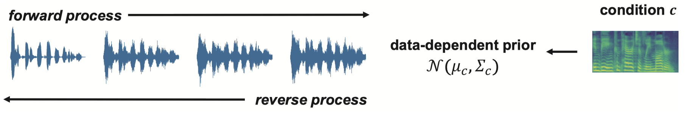

## PriorGrad-vocoder

This repository is an official PyTorch implementation of the paper:

> Sang-gil Lee, Heeseung Kim, Chaehun Shin, Xu Tan, Chang Liu, Qi Meng, Tao Qin, Wei Chen, Sungroh Yoon, Tie-Yan Liu. "PriorGrad: Improving Conditional Denoising Diffusion Models with Data-Dependent Adaptive Prior." _ICLR_ (2022).
>[[arxiv]](https://arxiv.org/abs/2106.06406)
>



This repository contains a vocoder model (mel-spectrogram conditional waveform synthesis) presented in PriorGrad. PriorGrad vocoder features the state-of-the-art audio quality among the likelihood-based neural vocoders, with fast training and inference speed. 

## Abstract
Denoising diffusion probabilistic models have been recently proposed to generate high-quality samples by estimating the gradient of the data density. The framework assumes the prior noise as a standard Gaussian distribution, whereas the corresponding data distribution may be more complicated than the standard Gaussian distribution, which potentially introduces inefficiency in denoising the prior noise into the data sample because of the discrepancy between the data and the prior. In this paper, we propose PriorGrad to improve the efficiency of the conditional diffusion model (for example, a vocoder using a mel-spectrogram as the condition) by applying an adaptive prior derived from the data statistics based on the conditional information. We formulate the training and sampling procedures of PriorGrad and demonstrate the advantages of an adaptive prior through a theoretical analysis. Focusing on the audio domain, we consider the recently proposed diffusion-based audio generative models based on both the spectral and time domains and show that PriorGrad achieves faster convergence and superior performance, leading to an improved perceptual quality and tolerance to a smaller network capacity, and thereby demonstrating the efficiency of a data-dependent adaptive prior.

## Demo

Refer to the [demo page](https://speechresearch.github.io/priorgrad/) for the samples from the model.

## Quick Start and Examples

1. Navigate to PriorGrad-vocoder root and install dependencies
   ```bash
   # the codebase has been tested on Python 3.8 with PyTorch 1.8.2 LTS and 1.10.2 conda binaries
   pip install -r requirements.txt
   ```

2. Modify `filelists/train.txt`, `filelists/valid.txt`, `filelists/test.txt` so that the filelists point to the absolute path of the wav files. The codebase provides the LJSpeech dataset template. 

3. Train PriorGrad-vocoder 

   ```bash
   # the following command trains PriorGrad-vocoder with default parameters defined in params.py
   # need to specify model_dir, data_root, and training filelist
   CUDA_VISIBLE_DEVICES=0 python __main__.py \
   checkpoints/priorgrad \
   /path/to/your/LJSpeech-1.1 \
   filelists/train.txt
   ```
   The training script first builds the training set statistics and saves it to `stats_priorgrad` folder created at `data_root` (`/path/to/your/LJSpeech-1.1` in the above example).

   It also automatically saves the hyperparameter file (`params.py`), renamed as `params_saved.py`, to `model_dir` at runtime to be used for inference.

4. Inference (fast mode with T=6)
   ```bash
   # the following command performs test set inference of PriorGrad-vocoder with default parameters defined in params.py
   # inference requires the automatically generated params_saved.py during training, which is located at model_dir. 
   # need to specify model_dir, data_root, and test filelist
   CUDA_VISIBLE_DEVICES=0 python inference.py \
   checkpoints/priorgrad \
   /path/to/your/LJSpeech-1.1 \
   filelists/test.txt \
   --fast \
   --fast_iter 6
   ```
   
   `--fast` `--fast_iter 6` uses fast inference noise schedule with `--fast-iter` reverse diffusion steps.
   
   6, 12, and 50 `--fast_iter` are officially supported. If other value is provided, the model uses a linear beta schedule. Note that the linear schedule is expected to perform worse.
   
   If `--fast` is not provided, the model performs slow sampling with the same `T` step forward diffusion used in training.

   Samples are saved to the `sample_fast` if `--fast` is used, or `sample_slow` if not, created at the parent directory of the model (`checkpoints` in the above example). 

## Pretrained Weights
We release the pretrained weights of PriorGrad-vocoder model trained on LJSpeech for 3M steps.

`stats_priorgrad` saved at `data_root` is required to use the checkpoint for training and inference. Refer to the step 3 of the [Quick Start and Examples](#quick-start-and-examples) above.

Pre-built statistics (LJSpeech): [Download from Azure blob storage](https://msramllasc.blob.core.windows.net/modelrelease/stats_priorgrad.zip) and unzip the file to the root of the dataset (`/path/to/your/LJSpeech-1.1` in the above example). 

PriorGrad: [Download from Azure blob storage](https://msramllasc.blob.core.windows.net/modelrelease/priorgrad_voc.zip) and unzip the file to `checkpoints/priorgrad`

The codebase defines `weights.pt` as a symbolic link of the latest checkpoint.
Restore the link with `ln -s weights-3000000.pt weights.pt` to continue training (`__main__.py`), or perform inference (`inference.py`) without specifying `--step`


## Reference
If you find PriorGrad useful to your work, please consider citing the paper as below:

      @inproceedings{
      lee2022priorgrad,
      title={PriorGrad: Improving Conditional Denoising Diffusion Models with Data-Dependent Adaptive Prior},
      author={Lee, Sang-gil and Kim, Heeseung and Shin, Chaehun and Tan, Xu and Liu, Chang and Meng, Qi and Qin, Tao and Chen, Wei and Yoon, Sungroh and Liu, Tie-Yan},
      booktitle={International Conference on Learning Representations},
      year={2022},
      }

## Code of Conduct
This project has adopted the [Microsoft Open Source Code of Conduct](https://opensource.microsoft.com/codeofconduct),
[trademark notice](https://docs.opensource.microsoft.com/releasing/), and [security reporting instructions](https://docs.opensource.microsoft.com/releasing/maintain/security/).