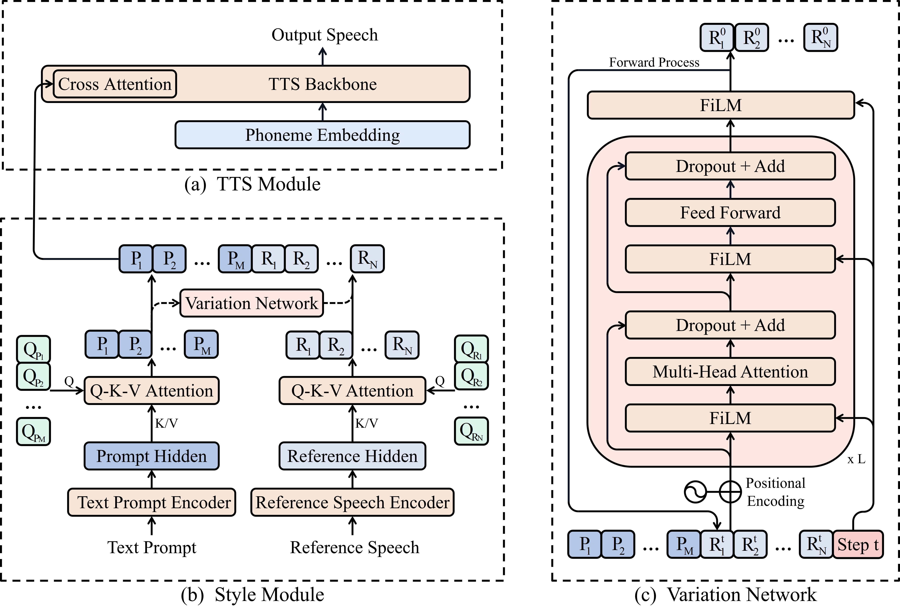

<h2 align="center">
<p>Variation Network
</h2>

 <!-- - [Introduction](#Introduction)
 - [Prepare](#Prepare)  
 - [Variation_Network](#Variation_Network)   -->

## Introduction

<p align="center"><br/> Model structure of PromptTTS 2 </p>

Considering the main TTS backbone in PromptTTS 2 is NaturalSpeech 2 (https://arxiv.org/abs/2304.09116), whose open-source procedure is still ongoing due to the potential ethics issue of zero-shot TTS, we just release the code of variation network.

Variation network can generate the control signal of TTS system (e.g., NaturalSpeech 2) conditioned on the prompt signal such as text description (BERT/T5 representations) or facial image (CLIP representations) with the help of a Transformer-based diffusion model.


## Prepare 

For environment, just run:

```bash
pip install -r requirements.txt 
```

## Variation Network

The variation network can be instantiated by providing layer number and hidden size:


```Python
from variation_network import TransformerEstimator
vnet = TransformerEstimator(
    num_layers=12,
    hidden_size=512,
    query_tokennum=8,
)
```

The `variation_network` can be used to predict **noise** or **x_0** in diffusion models.

For diffusion model, we use the fomulation in [Grad-TTS](https://github.com/huawei-noah/Speech-Backbones/blob/main/Grad-TTS/model/diffusion.py#L227) while using `variation_network` as `estimator`. 
